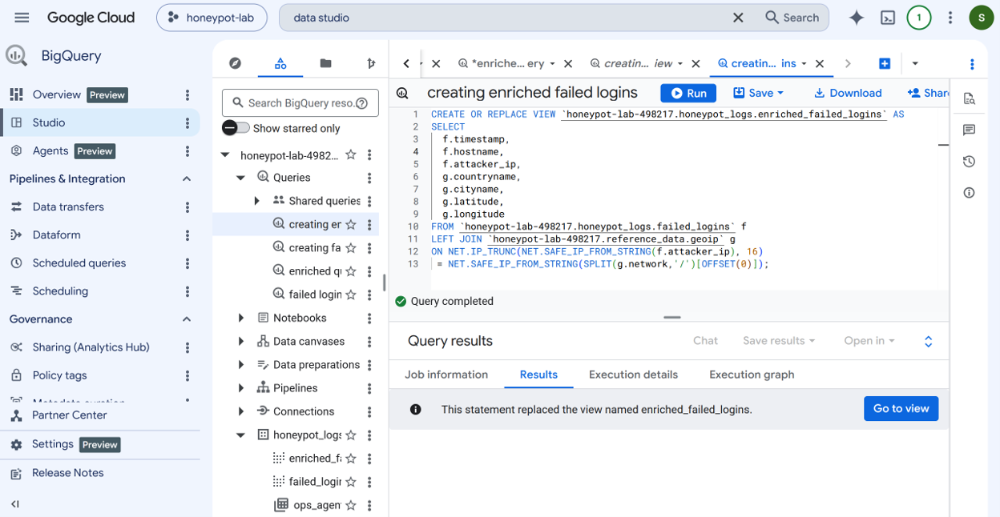
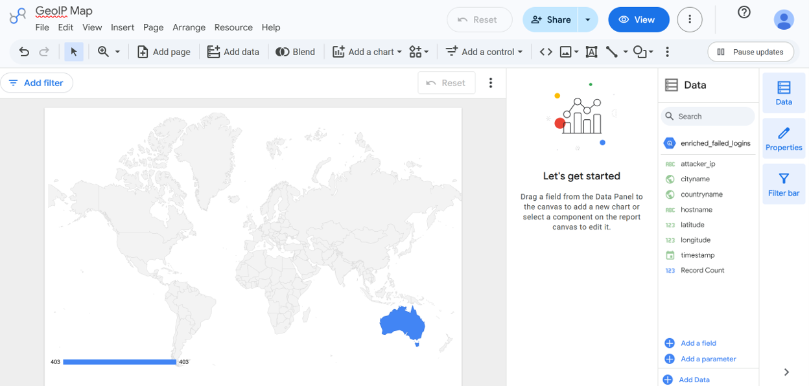
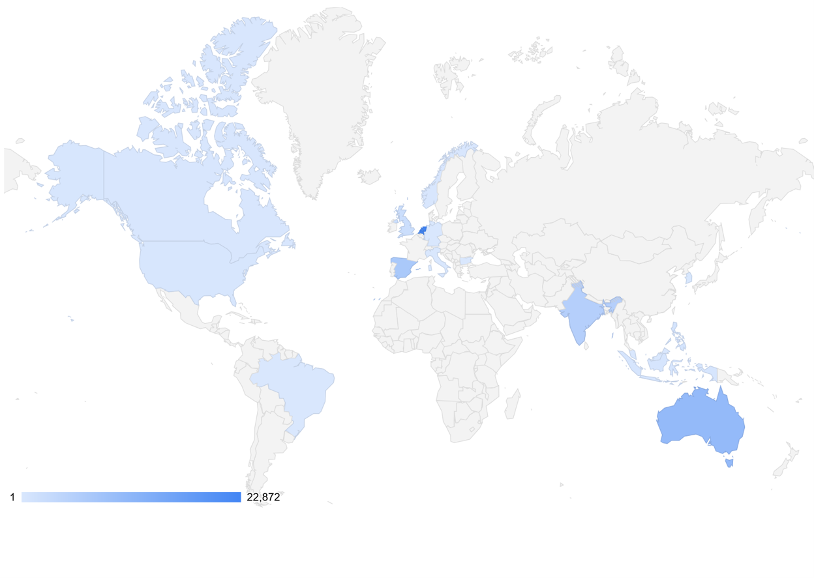
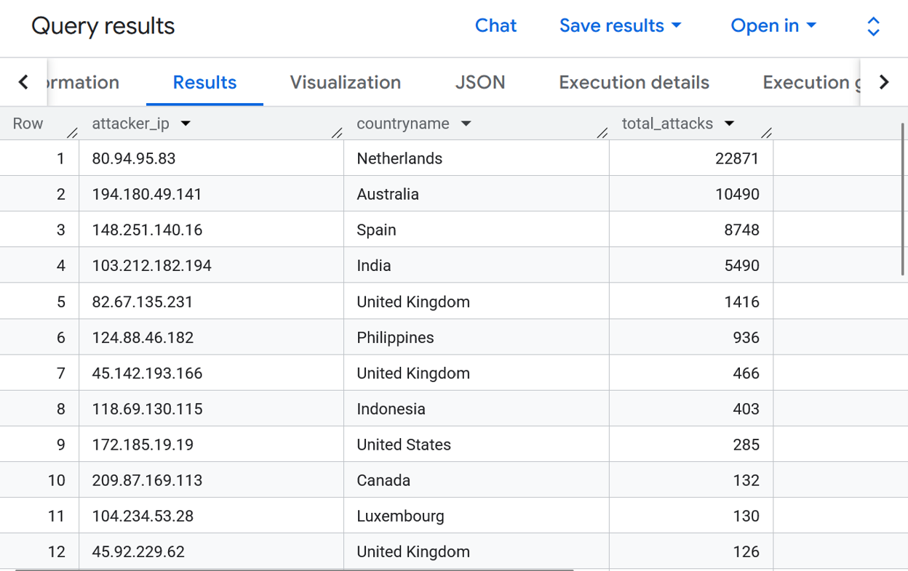
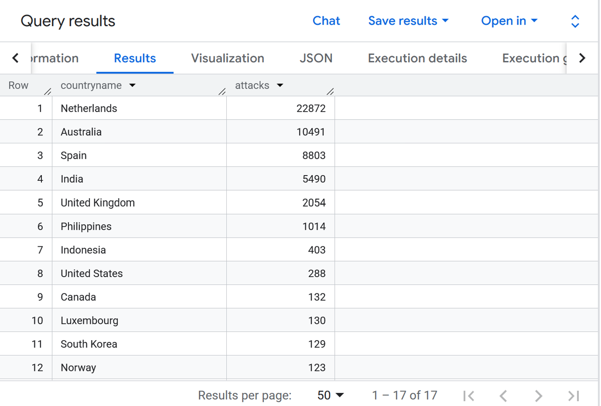

# Cloud-Honeypot
Designed and deploy a honeypot in Google Cloud Platform, open it to the public Internet, log forwarding into a respository, and create an attack map of failed logins around the world. 

Skills Learned
- Centralized logging
- Security Event Analysis
- Querying
- Enrichment
- Threat Hunting
- Attack Visualization

Architecture
Internet Attackers
        │
        ▼
Windows Honeypot VM
        │
        ▼
Cloud Logging
        │
        ▼
Log Router Sink
        │
        ▼
BigQuery
        │
        ▼
GeoIP Enrichment 
        │
        ▼
Looker Studio Attack Map (Data Studio)


## Part 1: Create Honeypot VM
Manage resources -> Create project -> "honeypot-lab"


Enable Compute Engine and Cloud Logging APIs
Create VM instance

Don't forget to enable "Install Ops Agent"

I sucessfully logged into my VM remotely.


### Disble firewall
Go to VPC -> Firewall -> Add firewall rule
Name: allow-all-ingress
Direction: Ingress
Source: 0.0.0.0/0
Protocols: All
Action: Allow


Back in the Windows VM, I went to Windows Defender Firewall, click on Properties, and turned off the firewall for Domain Profile, Private Profile, and Public Profile. 


## Part 2: Testing and verifying logs
I logged out of my Windows VM. I then failed three times as "employee" to login and then three more times as "admin." Afterwards, I logged in properly and checked what logs I've generated in Event Manager. 


## Part 3: Logging Pipeline and Configuration
In the Windows VM, I went to the following path to configure the config.yaml file for Ops Agent. 
```
C:\Program Files\Google\Cloud Operations\Ops Agent\config
```
In the config.yaml file, I added the following:
```
logging:
  receivers:
    windows_security:
      type: windows_event_log
      channels:
        - Security

  service:
    pipelines:
      security_pipeline:
        receivers:
          - windows_security
```

After saving my changes, I went to PowerShell as Administrator. I stop and start the service to ensure my changes occured.
```
Stop-Service -Name "google-cloud-ops-agent" -Force
Start-Service -Name "google-cloud-ops-agent"
Get-Service -Name "google-cloud-ops-agent"
```


Going to Monitoring -> Logs Explorer
```
resource.type="gce_instance"
"4625"
```
I verified that my logs were being properly pipelined. 


## Part 4: BigQuery Dataset, Configure Logs to go to this Dataset
In BigQuery Studio, I create a dataset called "honeypot_logs"


Back in Monitoring, I went to Log Router and Create Sink to send my Logs to my dataset.


In BigQuery Studio, I verifiy if my logs went through.


## Part 5: GeoIP Database
I downloaded GeoIP and uploaded to BigQuery Studio as a dataset "reference_data"
```
BigQuery Studio
Create dataset: reference_data
Upload: geoip_summarized.csv
Create table: geoip
Auto-Detect fields
```


## Part 6: Create queries and views
### failed logins query

###
creating failed_logins

###
failed_logins

###
enriched query

###
enriched failed logins view



## Part 7: Attack Map creation


At this point, I decided to leave the VM on for a day to left it to attacked.  

Once I returned the following day, I checked on the map and saw about 13,000 attacks from a single country. When I went to my queries, I found out that I couldn't see logs from today at all. I figured out that my queries were only able to query from yesterday, and not also today. I changed them and my queries showed me today and yesterday's attacks. As well as on my attack map.
Here is my improved failed_logins
```
CREATE OR REPLACE VIEW `honeypot-lab-498217.honeypot_logs.failed_logins` AS
SELECT
  timestamp,
  jsonPayload.computername AS hostname,
  jsonPayload.eventid AS event_id,
  jsonPayload.stringinserts[SAFE_OFFSET(19)] AS attacker_ip,
  jsonPayload.message
FROM `honeypot-lab-498217.honeypot_logs.windows_event_log_*`
WHERE jsonPayload.eventid = 4625
  AND _TABLE_SUFFIX BETWEEN FORMAT_DATE('%Y%m%d', DATE_SUB(CURRENT_DATE('UTC'), INTERVAL 1 DAY)) 
                        AND FORMAT_DATE('%Y%m%d', CURRENT_DATE('UTC'));
```
Here is my improved enriched_failed_logins
```
CREATE OR REPLACE VIEW `honeypot-lab-498217.honeypot_logs.enriched_failed_logins` AS
SELECT
  f.timestamp,
  f.hostname,
  f.attacker_ip,
  g.countryname,
  g.cityname,
  g.latitude,
  g.longitude
FROM `honeypot-lab-498217.honeypot_logs.failed_logins` f
LEFT JOIN `honeypot-lab-498217.reference_data.geoip` g
ON NET.IP_TRUNC(NET.SAFE_IP_FROM_STRING(f.attacker_ip), 16) = 
   NET.IP_TRUNC(NET.SAFE_IP_FROM_STRING(SPLIT(g.network, '/')[OFFSET(0)]), 16);
```
Here is how my attack map looked: 


## Part 8: Threat Hunting
From the single day my Windows VM was opened to the Internet, it experienced about 50,000 failed login attempts all around the world. 

I performed a SQL query to discover the top countries and their associated ips who attacked the most frequently my VM. 
```
SELECT
  attacker_ip,
  countryname,
  COUNT(*) AS total_attacks
FROM `honeypot-lab-498217.honeypot_logs.enriched_failed_logins`
GROUP BY attacker_ip, countryname
ORDER BY total_attacks DESC;
```


In all likelihood, those top IPs are probably performing brute passwords attacks on my VM. 

The next query I performed was to figure out the top countries in general. 
```
SELECT
  countryname,
  COUNT(*) attacks
FROM `honeypot-lab-498217.honeypot_logs.enriched_failed_logins`
GROUP BY countryname
ORDER BY attacks DESC;
```


## What I learned

## Improvements
